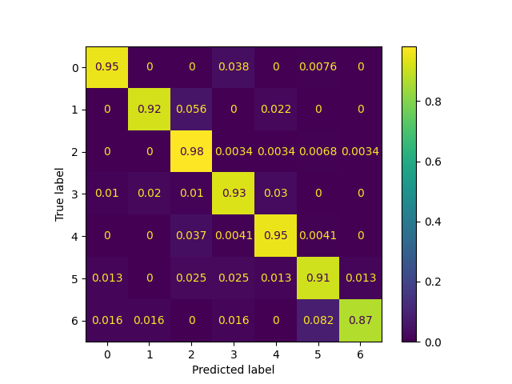
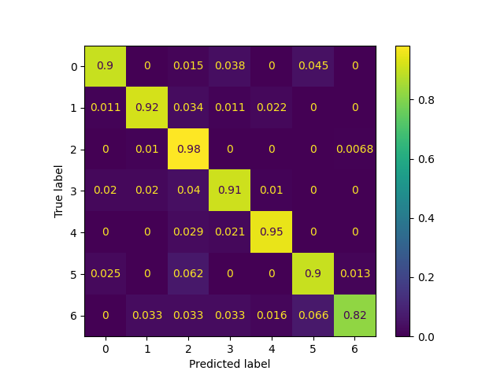
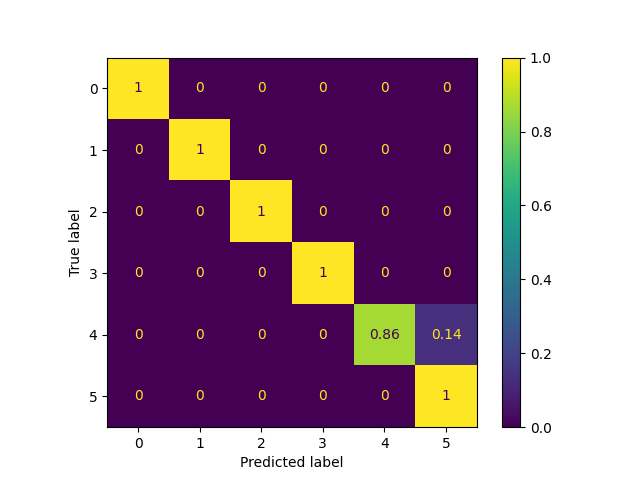
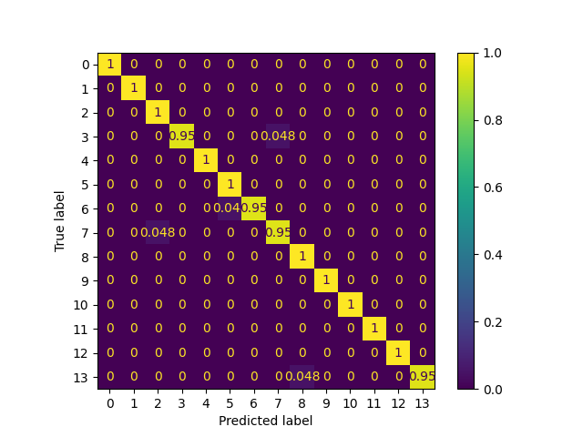
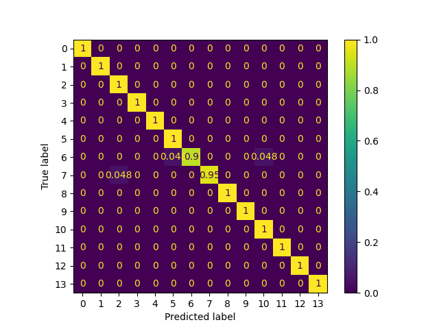
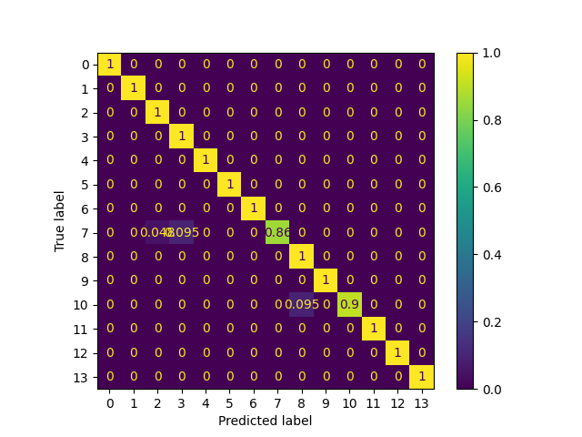

## Table of Contents

- [Table of Contents](#table-of-contents)
- [Abstract](#abstract)
- [1. Introduction](#1-introduction)
- [2. Background and Related Work](#2-background-and-related-work)
    - [Channel State Information (CSI)](#channel-state-information-csi)
    - [Feature Extraction](#feature-extraction)
        - [STFT](#stft)
        - [BVP](#bvp)
        - [General Feature Extractions](#general-feature-extractions)
    - [Deep Learning Models](#deep-learning-models)
    - [Motivation](#motivation)
- [3. Technical Approach](#3-technical-approach)
    - [Summary of Datasets](#summary-of-datasets)
    - [Code](#code)
- [4. Evaluation and Results](#4-evaluation-and-results)
    - [Confusion Matrices](#confusion-matrices)
        - [UT-HAR](#ut-har)
        - [NTU-Fi-HAR](#ntu-fi-har)
        - [NTU-Fi-HumanID](#ntu-fi-humanid)
- [5. Discussion and Conclusions](#5-discussion-and-conclusions)
- [6. References](#6-references)

## Abstract

Recent studies have developed different sensing applications like human activity
recognition (HAR) using WiFi channel state information (CSI) information.
However, they usually use high and different sampling rates of CSI, which is
impractical and will hurt the communication performance. Besides, different
sensing tasks or applications may require different minimum/best sampling rates
due to different movement speeds and highest frequency of the activities. E.g,
[[1]](#6-references) suggests CSI sampling rate should be chosen as 800Hz for
HAR, while [[2]](#6-references) uses 500Hz and [[3]](#6-references) uses 30Hz;
[[4]](#6-references) chooses 100Hz for indoor crowd counting;
[[5]](#6-references) exploits 200Hz for sign language recognition; etc.
Therefore, it’s interesting to explore different applications’ dependence on
sampling rates. In this study, we perform a comprehensive analysis of these
datasets, changing sampling rate and observing the impact on the accuracy of the
model. Our results find that each dataset has ample room to reduce sampling rate
without sacrificing accuracy.

## 1. Introduction

<!-- - Motivation & Objective: What are you trying to do and why? (plain English without jargon)
- State of the Art & Its Limitations: How is it done today, and what are the limits of current practice?
- Novelty & Rationale: What is new in your approach and why do you think it will be successful?
- Potential Impact: If the project is successful, what difference will it make, both technically and broadly?
- Challenges: What are the challenges and risks?
- Requirements for Success: What skills and resources are necessary to perform the project?
- Metrics of Success: What are metrics by which you would check for success? -->

Human Activity Recognition (HAR) is the process of identifying and interpreting
the actions and activities performed by humans through the analysis of data
collected from various sensors. This includes vision-based methods, Inertial
Measurement Units (IMU), microphones, and the focus of this work, Radio
Frequency (RF) sensors. In particular, WiFi-based HAR leverages native Multiple
Input Multiple Output (MIMO) Channel State Information (CSI) to detect changes
in WiFi signal strength. The goal of this research is to concentrate on
WiFi-based methods using pre-existing datasets. The primary contribution of this
work lies in the discovery that each dataset examined provides significant room
for sample reduction without compromising performance. This finding has
implications for optimizing data collection and processing in HAR, enhancing its
efficiency and practical applicability.

  
*Figure 1: An overview of various gestures recognizable from Widar [[8]](#6-references) dataset.*

The initial project proposal provided some background research which explained
that [[1]](#6-references) suggests CSI sampling rate should be chosen as 800Hz
for HAR as "typical human movement speed corresponds to CSI components of
300Hz", while [[2]](#6-references) uses 500Hz and [[3]](#6-references) uses
30Hz; [[4]](#6-references) chooses 100Hz for indoor crowd counting;
[[5]](#6-references) exploits 200Hz for sign language recognition; etc.

Each one of these works makes different claims and assumptions about the rate of
human activity movement which necessitates their use of a particular sampling
rate. While the literature explores the use of various models, it fails to
showcase concrete data on exploring various choices for sampling rate.
Therefore, this work aims to explore both of those dimensions.

The novelty of our project is that, there is not one specific sampling rate that is claimed to be the best. Each research group uses what they consider the best in their case. This results in not having a standardized set to which new researchers can reference that would save them time and effort at the beginning of their research.

Our metrics of success are the following: 

1. The first thing we want to show is what happens to the model if we were to change the sampling rate. 
2. What happens to the accuracy? 
3. Does it depend on the model used?
4. Does it depend on the dataset? 
            
We want to be able to categorize these details because many papers use different sampling rates to essentially do the same thing, identification over WiFi.

## 2. Background and Related Work

### Channel State Information (CSI)
The choice of WiFi-based Human Activity Recognition (HAR) is motivated by
distinct advantages over traditional camera-based systems. Camera systems, while
accurate and deterministic, pose limitations due to their requirement for direct
line-of-sight (LOS), raising privacy concerns and potential intentional evasion.
In contrast, WiFi, being ubiquitous in indoor settings, offers a compelling
alternative for HAR. WiFi-based HAR operates passively, mitigating privacy
concerns associated with cameras and eliminating the need for a direct line of
sight. This not only addresses privacy issues but also provides a more inclusive
and less intrusive method for detecting and interpreting human activities in
indoor environments. 
  
*Figure 2: On the top: a traditional vision-based tracking system. On the bottom is a WiFi based HAR system.*

Channel State Information (CSI) is highly preferred over something more general
like Received Signal Strength (RSS) for Human Activity Recognition (HAR) due to
its capacity to provide a more nuanced and comprehensive depiction of the WiFi
environment.  Unlike RSS, which merely averages signal strength across the
entire bandwidth, CSI encapsulates the amplitude and phase of each channel. This
yields a richer dataset for HAR, essentially creating a detailed "WiFi Image"
that captures the intricacies of signal propagation. 

### Feature Extraction
Feature extraction is a process in which relevant information or features are
selected or extracted from raw data to reduce its dimensionality or to transform
it into a more suitable format for analysis. It's important because it reduces
the dimensionality of data, allowing machine learning algorithms to focus on the
most relevant information and improving computational efficiency.  By capturing
essential patterns or characteristics, it enhances the performance of models in
various domains, such as image recognition, natural language processing, and
signal processing.

#### STFT
In the context of WiFi-based HAR, directly feeding CSI data into a model proves
impractical; thus feature extraction is paramount. To this end,  various
approaches are employed to enhance the interpretability of the data. One common
method, and that which is employed in the UT-HAR dataset [[7]](#6-references),
involves the application of Short-time Fourier transforms (STFT).  This
technique proves useful in finding the distinct phases of movements embedded
within the CSI data. 

*Figure 2: Another signal*

#### BVP
The Widar [[3]](#6-references) dataset utilizes the Body-coordinate velocity
profile (BVP) as a key component in its analysis. The data processing pipeline
involves two major stages following the acquisition of Channel State Information
(CSI): first, converting CSI to BVP, and then extracting relevant features from
the BVP. The subsequent work involves classifying activities based on this
Body-coordinate velocity profile.

*Figure 3: BVP pipeline from [[3]](#6-references)*

#### General Feature Extractions
EfficientFi [[2]](#6-references), authored by the creators of SenseFi and NTU
datasets, employs a pipeline involving feature extraction directly from raw CSI
data. They utilize a quantization method to compress the feature map by mapping
measured feature vectors to the nearest vector in a CSI codebook. Classification
is performed solely on the extracted features, and a decoder network is employed
to store CSI data on the server itself.

*Figure 4: architecture of NTU-Fi [[6]](#6-references)*

### Deep Learning Models
**MLP** (Multi-Layer Perceptron): Simple and robust architecture, but slow
*convergence and significant computational costs are drawbacks.

**CNN** (Convolutional Neural Network): Excels in capturing spatial and temporal
*features, but may have a limited receptive field due to kernel size and
*traditionally stacks all feature maps equally.

**RNN** (Recurrent Neural Network): Effective for handling time sequence data
*like video and Channel State Information (CSI), capable of memorizing
*arbitrary-length sequences. However, faces challenges in capturing long-term
*dependencies and suffers from the vanishing gradient problem during
*backpropagation.

**LSTM** (Long Short-Term Memory): Addresses the vanishing gradient problem in
*traditional RNNs, allowing better handling of long-term dependencies. However,
*it introduces increased complexity compared to standard RNNs.

### Motivation
The motivation of previous works in this domain involved modifying the Channel State Information (CSI) at the edge, followed by post-processing, potentially including denoising, and feature extraction using methods like Short-Time Fourier Transform (STFT) and Velocity Profile. The feature data is then offloaded to servers for machine learning classification. The primary goal of *this work* is to analyze the impact of sampling rate on classification performance, with the potential benefit of minimizing traffic between the edge and the cloud.

*Figure 5: General WiFi HAR processing architecture with emphasis where our work explores*

## 3. Technical Approach

In this work, we make use of several datasets as follows:

1. **UT-HAR [[7]](#6-references):** Includes measurements of 7 different activities.
2. **NTU-FI [[6]](#6-references):** A Human Activity Recognition (HAR) dataset featuring 6 different activities.
3. **HumanID:** A dataset focused on the gait of 15 individuals.
4. **Widar [[3]](#6-references):** Comprises a dataset with records of 22 different activities.
5. **SignFi [[5]](#6-references):** Involves a dataset with 256 different signed symbols.

Furthermore, we build upon the framework from SenseFi [[6]](#6-references), which uses Python,
Pytorch, and some other works [[5]](#6-references) which use Matlab. 

Lastly, we make use of the following models:
- Multi-layer Perceptron (MLP)
- Recurrent Neural Network (RNN)
- Gated Recurrent Unit (GRU)
- Gated Recurrent Unit + Convolutional Neural Network (GRU+CNN)
- LeNet (Special Type of CNN) [[6]](#6-references)
- CNN – Used in SignFi

### Summary of Datasets
|    Datasets    |                             Activities                              |               Environment               |                  Number of subjects/samples                  |   BW   | Time of Each Activity |
| :------------: | :-----------------------------------------------------------------: | :-------------------------------------: | :----------------------------------------------------------: | :----: | :-------------------: |
|   NTU-Fi-HAR   | 6: running, walking, falling, boxing, circling arms, cleaning floor |                   Lab                   |              20 people, each activity 20 times               | 40 MHz |          5s           |
| NTU-Fi-HumanID |                          15 people’s gait                           |             Lab, 3 scenario             |                          15 people                           | 40 MHz |          5s           |
|     UT-HAR     |          6: lie down, fall, walk, run, sit down, stand up           |                 Office                  | 6 people, 20 trials per activity Data collected continuously | 20 MHz |          20s          |
|     Widar      |         22: Push, Pull,Sweep,Clap,Slide, 18 types of Draws          | 3 environments: classroom, hall, office |                        16 volunteers                         | 20 MHz |     Not Available     |
|     SignFi     |                         276 signed gestures                         |                Lab, home                |                           5 people                           | 20 MHz |         2.5s          |

### Code
Once the datasets are downloaded, we forked the SenseFi repository and made
signifcant modifications to their framework to help address our research
questions. Specifically, our code includes approaches to
downsampling, matrix reduction, and modifications to alter the number of
subcarriers, thus effectively influencing the bandwidth of the data. We explore
different downsampling methods, ranging from straightforward matrix reduction
techniques—such as selecting every nth column—to utilizing Python's decimate
function and implementing custom downsampling functions. Furthermore, our code
incorporates considerations for downsampling at different stages of data
processing, be it before or after converting the data into tensor format. To
enhance our data analysis capabilities, we have also integrated functionality to
generate a confusion matrix. Overall, these code implementations contribute to a
comprehensive and flexible framework for processing and understanding the
intricacies of the datasets in our project.

Below is a summary of our methods:

- Matrix Reduction:
    - Taking every second column for half the sampling frequency, every 4th for ¼ the sampling, etc.
    - Example: x = x[:,::2];

- Decimate Function:
    - Using the decimate function in Python with a specified decimation factor (q=8, zero_phase=True).
    - Example: x = decimate(x, q=8, zero_phase=True)
    - To use this method, we had to include additional code: x=x.copy()
    - This was neccesary because when we used the decimate function, negative strides occur and as of the time of writing this report, PyTorch is not comptabile         with negative strides.
    - Strides are used to access the elements in the tensor.

- Custom Downsampling Functions:
    - Implementing custom downsampling functions.

- Different Areas for Downsampling:
    - Considering downsampling at various stages, such as pre or post converting the data to tensor format.

- Confusion Matrix Development:
    - Adding code to generate a confusion matrix for further data analysis.

- Changing the Number of Subcarriers:
    - Modifying the number of subcarriers, effectively altering the bandwidth.

These methods collectively address downsampling, matrix reduction, and
additional modifications to analyze and manipulate the data effectively in the
context of signal processing and machine learning.

## 4. Evaluation and Results
In this section, we will be discussing the results. We saw no difference with how we implemented the downsampling in the final accuracy. However, we did notice that the time to complete training would be servely delayed if we used the decimate function. This is because of the additional line of code needed to correct the negative strides would force the matrix to be reconstructed every single time. So, we used the matrix reduction method to generate results fastest. Additionally, the area of downsampling did not change the end results. So, we could downsample before or after converting the data to tensor format and saw no change in accuracy or runtime. 

*Figure 6: Accuracy vs Frequency plot for NTU-Fi-HAR dataset with various models*

As can be seen from Figure 6, very little change in accuracy when downsampling; the largest delta being ~5%. The best performing and most robust model was GRU in our experiments.

*Figure 7: Accuracy vs Frequency plot for NTU-Fi-HumanID dataset with various models*

As can be seen from Figure 7, there was very little change in accuracy as well when downsampling; the largest delta being ~4%. The best performing and most robust model was again GRU.

*Figure 8: Accuracy vs Frequency plot for UT-HAR dataset with various models*

As can be seen from Figure 8, there was more of a change in accuracy when downsampling compared to NTU-Fi-HAR and HumanID datasets; the largest delta being ~10%. However, it was still not a significant decrease. The best performing model here was LeNet, but the most robust was MLP.

*Figure 9: Accuracy vs Frequency plot for Widar dataset with various models*

As can be seen from Figure 9, there was a significant decrease in accuracy when downsampling occurred; the largest delta being ~50%. The best performing model here was MLP, but we did not have a robust model since all that were tested experienced similar results.

*Figure 10: Accuracy vs Frequency plot for SignFi dataset with a CNN model*

As can be seen from Figure 10, there was also a decrease in accuracy when downsampling. The accuracy would decrease ~10% each time the frequency was downsampled by half. 

### Confusion Matrices
The results above describe the overall accuracy of each dataset and model combination as a function of sampling rate. 
However, to gain a more detailed understanding of the tracking of each activity, we also generated confusion matrices for each dataset and model combination.

Interestingly, we observe accross the board that the accuracy per task is relatively consistent accross the sampling rates explored in this work. This is likely due to the fact that the activities are relatively distinct from one another, and thus the model is able to distinguish between them even with reduced sampling rates. 

For example, in UT-HAR we see that the model is able to distinguish between the "Lie Down" and "Fall" activities with high accuracy, even at the lowest sampling rate of 50 Hz. This is likely due to the fact that the "Lie Down" activity is a relatively static activity, while the "Fall" activity is a dynamic activity. Thus, the model is able to distinguish between the two activities even with reduced sampling rates.

Furthermore, in NTU-Fi-HAR we see that the model is able to distinguish between the "Run" and "Walk" activities with high accuracy. This is likely due to the fact that the "Run" activity is much faster periodically relative to a  "Walk" activity.

And lastly, in NTU-Fi-HumanID we see that the model is able to distinguish between the specific individuals with high accuracy. This is likely due to the fact that the gait of each individual is unique enough to provide proper classification. 

The resulting confusion matrices are shown below.

#### UT-HAR

| Code | Activity |
| ---- | -------- |
| 0    | Lie down |
| 1    | Fall     |
| 2    | Walk     |
| 3    | Pick up  |
| 4    | Run      |
| 5    | Sit down |
| 6    | Stand up |

  
*Figure 11: Confusion Matrix for UT-HAR dataset with GRU model and 250 Hz sampling rate*

  
*Figure 12: Confusion Matrix for UT-HAR dataset with GRU model and 125 Hz sampling rate*

   
*Figure 13: Confusion Matrix for UT-HAR dataset with GRU model and 50 Hz sampling rate*

#### NTU-Fi-HAR

| Code | Object |
| ---- | ------ |
| 0    | Box    |
| 1    | Circle |
| 2    | Clean  |
| 3    | Fall   |
| 4    | Walk   |
| 5    | Run    |

  
*Figure 14: Confusion Matrix for NTU-Fi-HAR dataset with GRU model and 500 Hz sampling rate*

  
*Figure 15: Confusion Matrix for NTU-Fi-HAR dataset with GRU model and 250 Hz sampling rate*

  
*Figure 16: Confusion Matrix for NTU-Fi-HAR dataset with GRU model and 125 Hz sampling rate*

#### NTU-Fi-HumanID
  
*Figure 17: Confusion Matrix for NTU-Fi-HumanID dataset with GRU model and 500 Hz sampling rate*

  
*Figure 18: Confusion Matrix for NTU-Fi-HumanID dataset with GRU model and 250 Hz sampling rate*

  
*Figure 19: Confusion Matrix for NTU-Fi-HumanID dataset with GRU model and 125 Hz sampling rate*

## 5. Discussion and Conclusions
From our results, we can see that datasets that had less activities would be
less affected by downsampling. NTU-Fi-HAR had 6 activities but only two of them
were similar. This explains why the accuracy did drop slightly with downsampling
but not much overall. NTU-Fi-HumanID had 15 "activites" each representing the
gait of distinct individuals. The accuracy changed very little as well because
the gait of an individual can be unique enough to provide proper classification.
UT-HAR had 7 activities and did see more of a decrease in accuracy when compared
to NTU-Fi datasets. This is because UT-HAR had 2 pairs of activites that were
similar that when downsampling could be potentially misclassified resulting in
the decrease in accuracy we saw. Widar and SignFi had the largest decrease in
accuracy because those two had more similar activites. Widar dataset is composed
of 22 activites, 18 of which draws using hands, and SignFi dataset has 276
signed gestures. When downsampling, the information to properly classify the
hand gestures or draws could have been lost or not enough information was
present to properly classify the signs. 

Additionally, we saw some interesting results that should be explored further.
When comparing the datasets and how they were structured, we noticed that the
ones that were composed of only the amplitude component of the CSI data
performed better. This included NTU-Fi datasets and the UT-HAR dataset. In
contrast, the datasets composed of both the amplitude and phase component
performed worse. SignFi directly used the amplitude and phase components in it's
code and Widar dataset was composed of BVP which are derived from the amplitude
and phase. This should be explored further to rule out as a contributing factor.

Also, changing the subcarriers used did affect the accuracy. We conducted an
experiment where we divided the subcarriers into even groups of 3. When the
second and thrid group were used, the accuracy would be around the same as if we
used the entire set of subcarriers. However, when we used the first group, the
accuracy decreased about 20-30%. Due to time constraint and this being out of
scope of the project, we could not dive more into this but it should also be
explored further. The accuracy did not change if we kept the same subcarrier
group constant but downsampled. 

Overall, we succeeded in identifying the effect of downsampling on the accuracy
of WiFi sensing for various models and datasets that contained many different
activites. We also indentified potential areas for future work.

First, it would be interesting to explore downsampling the raw data. This
project focused on the downsampling pre-processed data. But what would happen if
the downsampling occured on the raw data? Would the results be any different?
Also, if you processed the downsampled raw data would it match the downsampled
pre-processed data from this experiment?

Second, the subcarrier selection should be explored further; it seemed to be
headed to some interesting results. Third, explore various models and
architectures. Fourth, explore using multi-modal HAR like combining multiple
data sets/sensors. Lastly, exploring which activities require CSI amplitude for
proper classification vs which require amplitude and phase. This should be
explored only if the correlation that we noticed is confirmed.

Lastly, we did face some challenges throughout the project. 

1) Both of us had lack of experience with different models of machine learning so we had to understand those better. 
2) Comparing multiple datasets in this context is a challenge due to the sheer number of variables and overall differences between the compositions of the data and the activities they’re measuring.
3) Finding computational resources took some initial time. We ran into memory issues because others were also using it to train their own models for other tasks.
4) Understanding the various ways datasets were normalized.

We would like to thank Professor Mani Srivastava and Gaofeng Dong for their support and guidance throughout this project.

## 6. References
[1] Wang, Wei, et al. "Understanding and modeling of wifi signal based human activity recognition." MobiCom (2015).

[2] Yang, Jianfei, et al. "EfficientFi: Toward large-scale lightweight WiFi sensing via CSI compression." IEEE Internet of Things Journal (2022).

[3] Guo, Linlin, et al. "Wiar: A public dataset for wifi-based activity recognition." IEEE Access (2019).

[4] Hou, Huawei, et al. "DASECount: Domain-Agnostic Sample-Efficient Wireless Indoor Crowd Counting via Few-Shot Learning." IEEE Internet of Things Journal (2022).

[5] Ma, Yongsen, et al. "SignFi: Sign language recognition using WiFi." ACM IMWUT (2018).

[6] Yang, Chen, et al. "SenseFi: A Library and Benchmark on Deep-Learning-Empowered WiFi Human Sensing", Patterns (2023).

[7] Yousefi, Narui, et al. "A Survey on Behavior Recognition Using WiFi Channel State Information"IEEE Comunication Magazine (2017)

[8] Zheng Yang, Yi Zhang, Guidong Zhang, Yue Zheng, December 26, 2020, "Widar 3.0: WiFi-based Activity Recognition Dataset", IEEE Dataport, doi: https://dx.doi.org/10.21227/7znf-qp86.

[9] M. Cominelli, F. Gringoli and F. Restuccia, "Exposing the CSI: A Systematic Investigation of CSI-based Wi-Fi Sensing Capabilities and Limitations," 2023 IEEE International Conference on Pervasive Computing and Communications (PerCom), Atlanta, GA, USA, 2023, pp. 81-90, doi: 10.1109/PERCOM56429.2023.10099368.

[10] https://wirelesspi.com/advantages-and-disadvantages-of-ofdm-a-summary/

[11] From Y. LeCun, L. Bottou, Y. Bengio, and P. Haffner, “Gradient-based learning applied to document recognition,”Proceedings of the IEEE, vol.86,no.11,pp.2278–2324,1998.

[12] Sim JM, Lee Y, Kwon O. Acoustic Sensor Based Recognition of Human Activity in Everyday Life for Smart Home Services. International Journal of Distributed Sensor Networks. 2015;11(9). doi:10.1155/2015/679123
